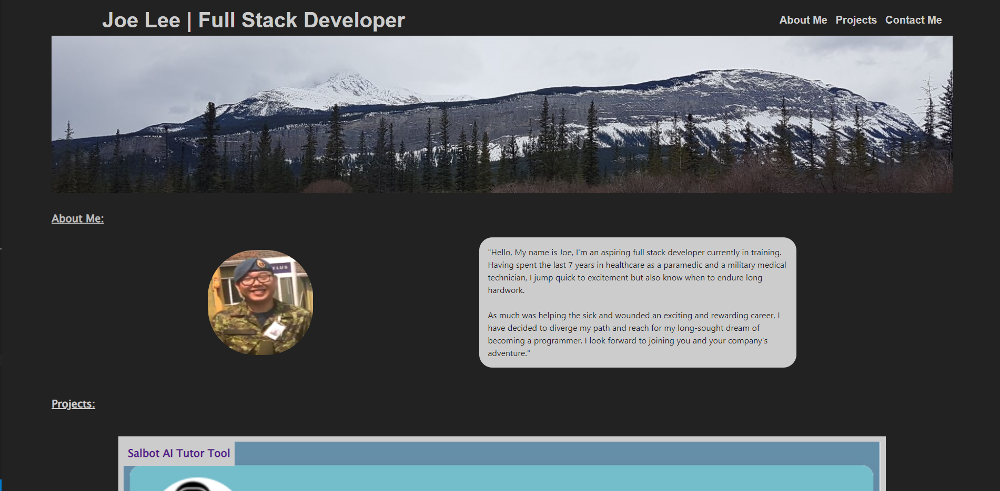
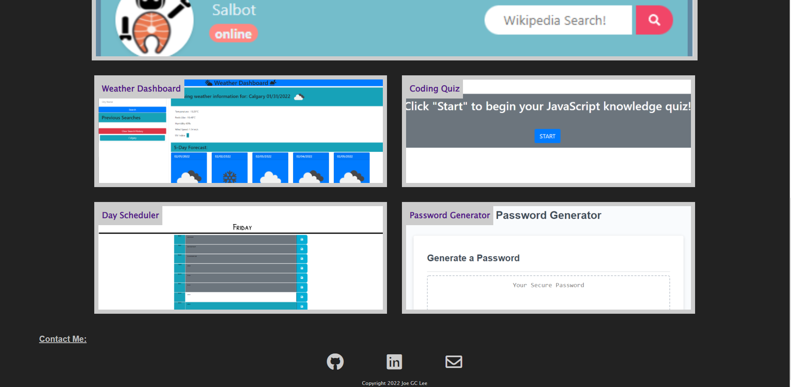
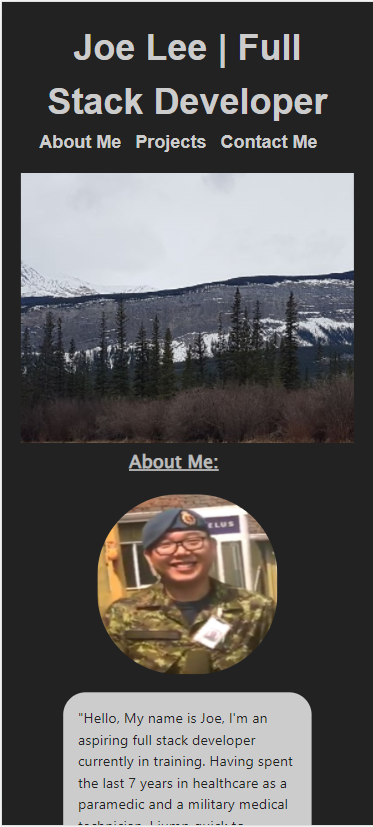
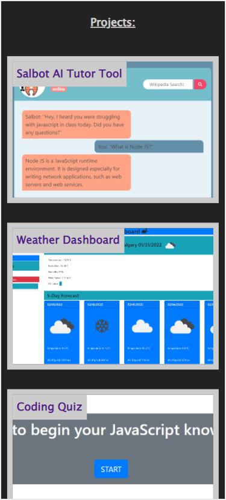
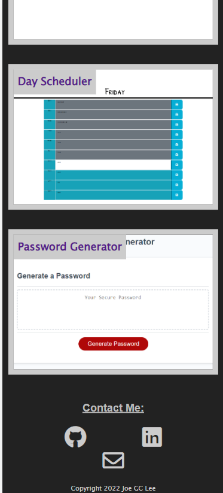

# Responsive-Portfolio

## Description
This is my portfolio containing my projects and future projects to come for future employment opportunities. This Portfolio contains the following sections: 

- Title and Navigation Bar
- About Me
- Projects 
- Contact Me 
    - link to my Github
    - link to my LinkedIn
    - Email  
    - Downloadable Resume 

## Deployment
Website is currently deployed on Git Pages: 

https://jollypong.github.io/Portfolio/

## Repository
Repository can be accessed at: 

https://github.com/jollypong/Portfolio

Repository contains: 
- index.html
- README.md 
- assets(folder)
    - style.css
    - reset.css
    - Lee-resume.pdf
    - 02-advanced-css-homework-demo
    - images(folder)
        - comingsoon.jpg
        - digital-marketing-meetings.jpg
        - mountain.jpg 
        - profile.jpg
        - codingQuiz.png
        - dayScheduler.png
        - passwordGenerator.png
        - salbotChat.png
        - weatherDashboard.png
        - portfolioScreenshotFullsize1.png
        - portfolioScreenshotFullsize1.png
        - portfolioScreenshotMobile1.png
        - portfolioScreenshotMobile2.png
        - portfolioScreenshotMobile3.png
     
## Screenshots

 

 

 

 

## Contribution
Joe Lee @ https://github.com/jollypong